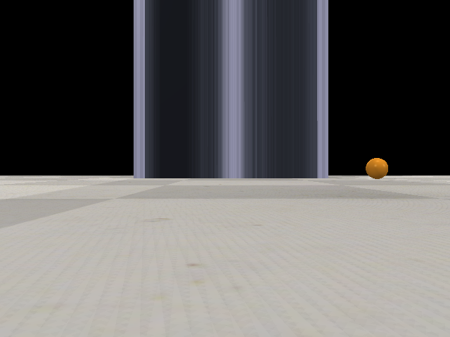

# actividad-2-02 — Image Capture in CoppeliaSim

## 1. Introduction

&ensp;&ensp;Deliverable for **Actividad 2.2** of M2. Visión Computacional (TE3002B, ITESM). Connects to a running CoppeliaSim scene over its ZeroMQ Remote API, starts the simulation, grabs a single frame from a simulated vision sensor, and saves it to disk.

## 2. Specification

| # | Step |
|---|---|
| 1 | Connect via the ZeroMQ Remote API and get the vision sensor handle. |
| 2 | Start the simulation. |
| 3 | Wait 2 seconds, then capture the vision sensor image. |
| 4 | Stop the simulation. |
| 5 | Save the image as `resultado.png`. |

Constraint: the Windows-specific path used to locate the CoppeliaSim library must be removed before submission — the evaluator injects its own.

## 3. Implementation

&ensp;&ensp;`RemoteAPIClient` connects to CoppeliaSim and resolves the `/Vision_sensor` object handle. `sim.startSimulation()` is called, followed by a 2-second `time.sleep`, then `sim.getVisionSensorImg()` returns the raw buffer plus resolution, which is reshaped into an `(resY, resX, 3)` array with NumPy. The sensor returns RGB with the origin at the bottom-left, so the image is converted to BGR (`cv2.cvtColor`) and flipped vertically (`cv2.flip(img, 0)`) before `sim.stopSimulation()` and `cv2.imwrite`.

## 4. Requirements

- **CoppeliaSim (Edu)**, with the ZeroMQ Remote API enabled — download from [coppeliarobotics.com/downloads](https://www.coppeliarobotics.com/downloads) (free Edu license).
- `coppeliasim-zmqremoteapi-client`
- `opencv-python`
- `numpy`

## 5. How To Run

1. Open CoppeliaSim and load the scene `actividad-2-02.ttt`.
2. Run the script:

```bash
python3 actividad-2-02.py
```

The script currently keeps this line (line 3), used to import `coppeliasim_zmqremoteapi_client` from a local CoppeliaSim install:

```python
sys.path.append('/home/ed/Documents/CoppeliaSim_Edu_V4_10_0_rev0_Ubuntu22_04/programming/zmqRemoteApi/clients/python/src')
```

Per spec, this line should be removed before submitting (the evaluator adds its own automatically) — replace the path with your own CoppeliaSim install location, or drop the line entirely if `coppeliasim_zmqremoteapi_client` is already on your `PYTHONPATH`.

## 6. Output



`resultado.png` — 640×480, captured from the simulated vision sensor.
