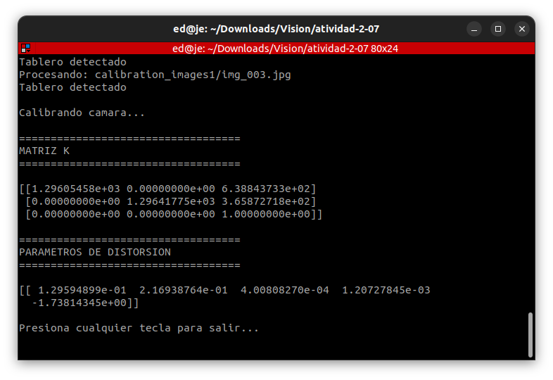
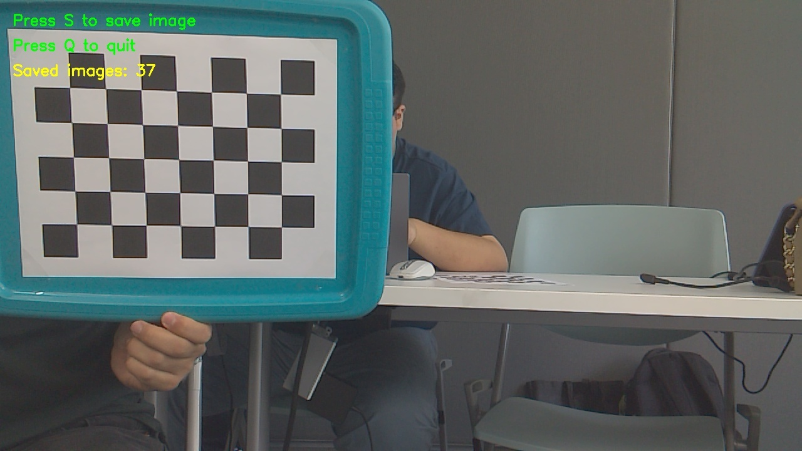
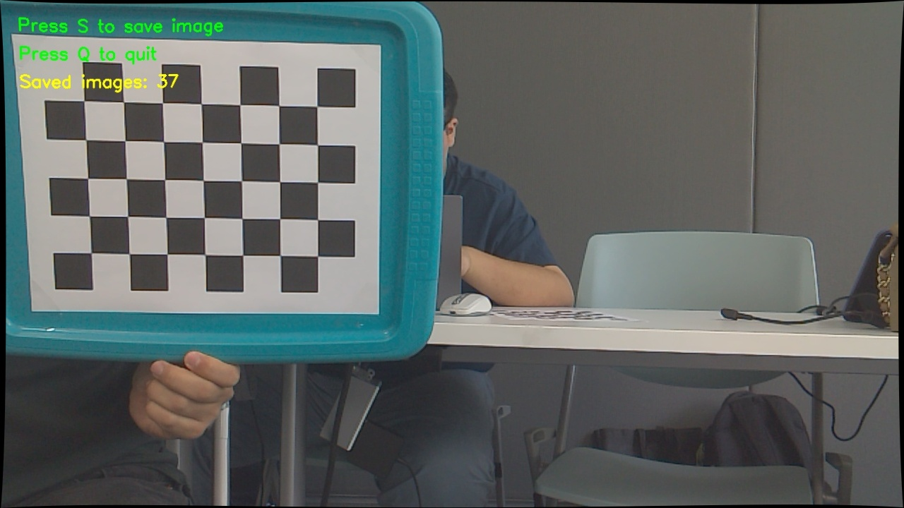

# actividad-2-07 — Camera Calibration (Puzzlebot)

## 1. Introduction

&ensp;&ensp;Deliverable for **Actividad 2.7** of M2. Visión Computacional (TE3002B, ITESM). Calibrates the Puzzlebot's camera from a set of chessboard images, then undistorts a sample frame using the resulting parameters.

## 2. Specification

| # | Step |
|---|---|
| 1 | Obtain the camera matrix K and distortion parameters k1, k2 from a chessboard calibration set (`findChessboardCorners`, `cornerSubPix`, `calibrateCamera`). |
| 2 | Undistort an arbitrary image and display it (`undistort`, `imshow`). |

## 3. Implementation

&ensp;&ensp;`actividad_2_07.py` detects a 5×7 chessboard on every image in `calibration_images1/`, refines the corners with `cornerSubPix`, and runs `cv2.calibrateCamera` to get K and the distortion coefficients. It then undistorts the first image in the set with `getOptimalNewCameraMatrix` + `undistort`, saving both the original and undistorted frames.

&ensp;&ensp;`calibration_images/` (50 images, 1280×720) is the set actually used by the script and the one the camera parameters are traceable to — it matches the naming pattern and output path (`calibration_images/`) that `capture_images.py` writes when saving frames from the Puzzlebot's ROS2 image topic (subscribed to `/video_source/raw`, key `s` to save each frame). It's a ROS2 capture node, not part of the calibration algorithm itself.

## 4. Requirements

- Python 3
- `opencv-python`
- `numpy`
- Puzzlebot camera + ROS2, only for `capture_images.py` (dataset capture).

## 5. How To Run

```bash
python3 actividad_2_07.py
```

## 6. Output



| Original | Undistorted |
|---|---|
|  |  |
