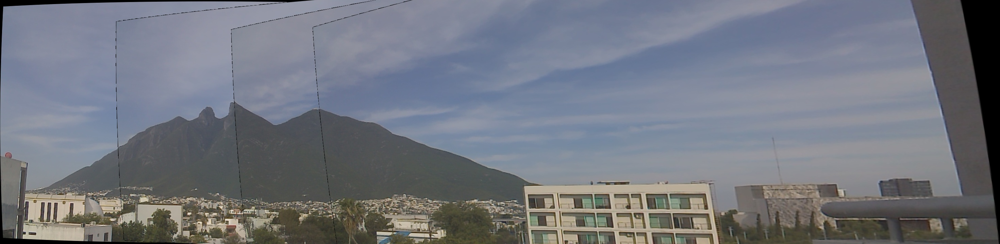

# actividad-2-08 — Campus Panorama Stitching

## 1. Introduction

&ensp;&ensp;Deliverable for **Actividad 2.8** of M2. Visión Computacional (TE3002B, ITESM). Stitches a set of overlapping photos into a single panorama using a manual SIFT-based pipeline (no `cv2.Stitcher`).

## 2. Specification

| # | Step |
|---|---|
| 1 | Capture a video or ≥3 photos of a campus area with ~70% overlap. |
| 2 | Calibrate a camera (K, k1, k2). |
| 3 | Undistort each image, then stitch: SIFT → BFMatcher/knnMatch → Lowe ratio → `findHomography`+RANSAC → `perspectiveTransform` → `warpPerspective`. |

## 3. Implementation

&ensp;&ensp;`actividad_2_08.py` undistorts each of the 4 images in `panorama_images/` with a hardcoded K/dist, then iteratively stitches them — SIFT features, `BFMatcher.knnMatch` (k=2) with a 0.75 Lowe ratio, `findHomography` with RANSAC, `warpPerspective`, and a manual pixel-fill merge (any zero pixel in the warped canvas is replaced by the running panorama), cropped to the non-zero bounding box after each merge. Output: `panorama_final.jpg`.

&ensp;&ensp;The hardcoded distortion coefficients (`k1=1.29594899e-01`, `k2=2.16938764e-01`) are an exact match to the ones computed in `actividad-2-07/matrices.png`, confirming they come from that same Puzzlebot camera calibration. The K matrix (fx, fy, cx, cy) is close but not identical to actividad-2-07's — same camera, but from a separate calibration run whose source script/images are no longer in this folder, so it isn't reproducible from what's here.

## 4. Requirements

- Python 3
- `opencv-python`
- `numpy`

## 5. How To Run

```bash
python3 actividad_2_08.py
```

Reads all `.jpg` files in `panorama_images/`, writes `panorama_final.jpg`.

## 6. Output


