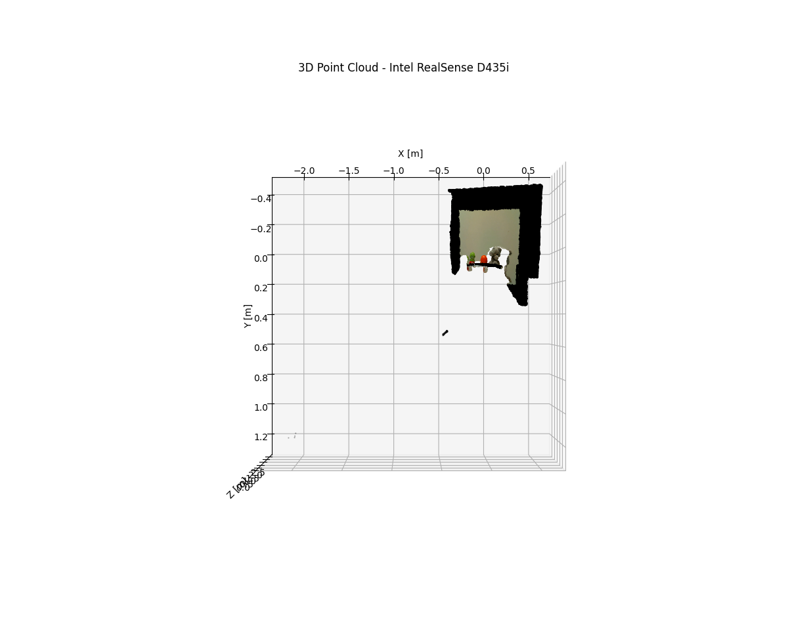
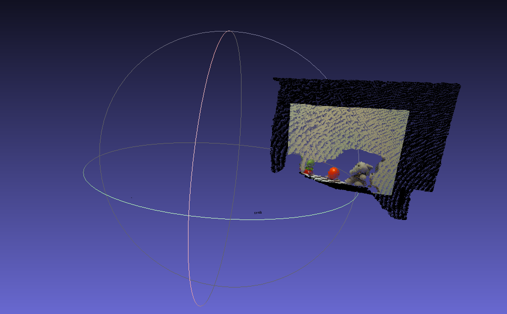

# actividad-2-09 — RGBD Point Cloud (RealSense D435i)

## 1. Introduction

&ensp;&ensp;Deliverable for **Actividad 2.9** of M2. Visión Computacional (TE3002B, ITESM). Backprojects an aligned RGB-D frame from an Intel RealSense D435i into a colored 3D point cloud, computing XYZ manually (no depth/point-cloud libraries).

## 2. Specification

| # | Step |
|---|---|
| 1 | Given an undistorted, aligned color image + aligned depth data + camera intrinsics, compute each pixel's 3D position. |
| 2 | Plot the resulting point cloud in 3D. |
| 3 | Export it to PLY. |

Constraint: XY must be computed manually (stereo-vision-style backprojection) — `pyrealsense2`, `kornia`, `pytorch`, `opencv-contrib-python`'s `cv2.rgbd.depthTo3d`, `PyntCloud`, `Open3D`/`o3d`, and `Pillow` are not allowed.

Rubric: 50% code, 25% Matplotlib 3D screenshot, 25% PLY screenshot in MeshLab.

## 3. Implementation

&ensp;&ensp;`actividad_2_09.py` loads K from `camera_intrinsics.csv`, reads `aligned_color.png` and the 16-bit `aligned_depth_raw.png`, then backprojects every 2nd pixel (`step=2`) with the pinhole formula `z = depth·0.001` (mm→m), `x = (u-cx)·z/fx`, `y = (v-cy)·z/fy`, discarding invalid (`z<=0`) or far (`z>3.0`) points. The resulting cloud is plotted with Matplotlib's 3D scatter (colored by the RGB frame) and exported as an ASCII PLY (`x y z r g b` per vertex).

## 4. Requirements

- Python 3
- `opencv-python`
- `numpy`
- `matplotlib`

## 5. How To Run

```bash
python3 actividad_2_09.py
```

Reads `camera_intrinsics.csv`, `aligned_color.png`, `aligned_depth_raw.png`; writes `ply_act9.ply` and shows the Matplotlib 3D plot.

## 6. Output

| Matplotlib 3D scatter | PLY in MeshLab |
|---|---|
|  |  |

[`ply_act9.ply`](ply_act9.ply) — exported point cloud.
