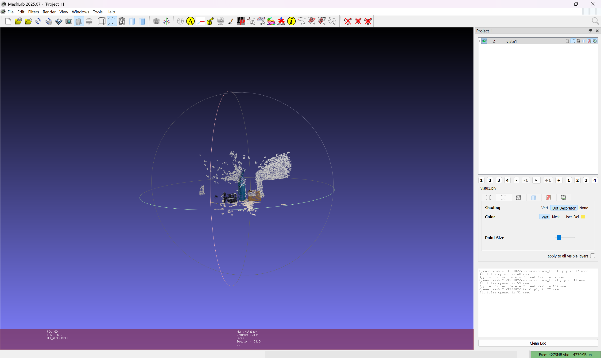
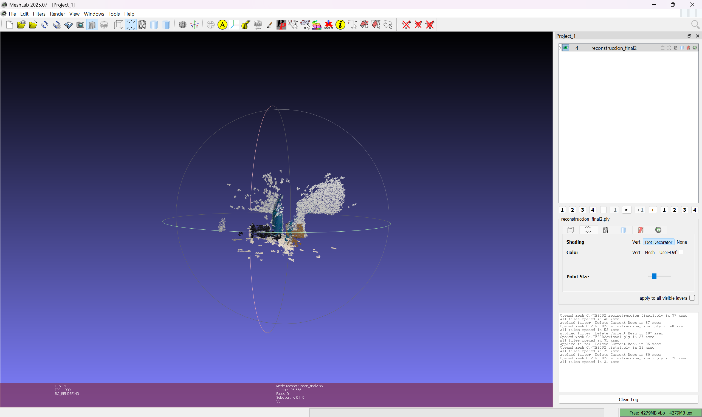

# actividad-2-10 — Stereo Point Cloud Reconstruction (ICP)

## 1. Introduction

&ensp;&ensp;Deliverable for **Actividad 2.10** of M2. Visión Computacional (TE3002B, ITESM). Builds two point clouds from two stereo pairs of the same scene shot from slightly different positions, then aligns them with ICP into a single 3D reconstruction.

## 2. Specification

| # | Step |
|---|---|
| 1 | Build a stereo camera from smartphones or the Puzzlebot's camera. |
| 2 | Capture the scene. |
| 3 | Compute the disparity map and the XYZ position of each pixel; save as PLY. |
| 4 | Shift the stereo camera horizontally and repeat for a second view. |
| 5 | Use a point-cloud library (e.g. Open3D, PCL) and ICP to align both views into one 3D reconstruction. |

Rubric: 25% code, 25%+25%+25% MeshLab screenshots of view 1, view 2, and the final reconstruction.

## 3. Implementation

&ensp;&ensp;For each of the two views, `actividad_2_10.py` loads its left/right pair, auto-corrects vertical misalignment (ORB features + RANSAC fundamental matrix to estimate the y-shift and disparity search range), computes disparity with `StereoSGBM`, backprojects it to XYZ, and cleans the resulting cloud (voxel downsampling + statistical/radius outlier removal) — saving `vista1.ply` / `vista2.ply`. The two clouds are then aligned with a two-stage ICP (coarse → fine, both `TransformationEstimationPointToPoint`), producing `vista2_alineada.ply` and the merged `reconstruccion_final2.ply`.

## 4. Requirements

- Python 3
- `opencv-python`
- `numpy`
- `open3d`

## 5. How To Run

```bash
python3 actividad_2_10.py
```

Expects `vista1_left.jpeg`, `vista1_right.jpeg`, `vista2_left.jpeg`, `vista2_right.jpeg` in the working directory (not included in this folder — only the code and result screenshots are kept here).

## 6. Output

Verified MeshLab screenshots (`MeshLab 2025.07`, per the title bar in each image):

| View 1 (`vista1.ply`, 32,885 pts) | View 2 (`vista2.ply`) | Reconstruction (`reconstruccion_final2.ply`, 25,556 pts) |
|---|---|---|
|  |  |  |
