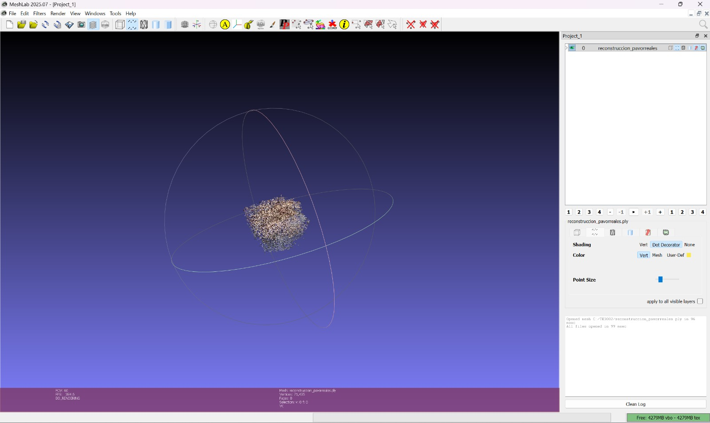

# examenfinal — Fish Tracking + Peacock Nest 3D Reconstruction

## 1. Introduction

&ensp;&ensp;Final exam deliverable for M2. Visión Computacional (TE3002B, ITESM) — individual, 15% of the course grade. Two parts: counting/tracking fish in a video, plus an extra-credit 3D reconstruction.

## 2. Specification

| # | Item | Points |
|---|---|---|
| 1 | Count every fish in `pecesoriginal-ns.mp4`. | 30 |
| 2 | Assign an ID to each fish and track it across frames. | 35 |
| 3 | Deliver a demo video, the prompts used, and the code (Gemini allowed as LLM, no image uploads to it; submission must not be a ZIP). | 35 |
| Extra | 3D reconstruction of the peacock nest from `pavorreales.mp4`, using any free tool; deliver a screenshot. | 15 |

## 3. Implementation

&ensp;&ensp;`examen_m2.py` uses `cv2.createBackgroundSubtractorMOG2` (150-frame warmup) to segment moving fish from the static sandy background, morphological open+dilate to clean the mask, and filters contours by area (8-150px) and aspect ratio (1.2-6.0, to keep elongated fish-like blobs and reject noise), plus a fixed exclusion band on a noisy left edge. A custom `CentroidTracker` (Euclidean nearest-neighbor matching, 35px max distance, deregisters after 20 missed frames) assigns and persists IDs across frames. Output: `peces_tracked.mp4`, annotated with per-fish ID and a live count HUD; final stats (max concurrent fish, average, total processed) are printed at the end.

## 4. Requirements

- Python 3
- `opencv-python`
- `numpy`

## 5. How To Run

```bash
python3 examen_m2.py
```

Reads `pecesoriginal-ns.mp4`, writes `peces_tracked.mp4`.

## 6. Output — Fish Tracking

Output: `peces_tracked.mp4`, a video of the source footage with each detected fish circled, labeled with its tracked ID, and a live on-screen fish count.

## 7. Extra Credit — Peacock Nest 3D Reconstruction

MeshLab screenshots of `reconstruccion_pavorreales.ply` (71,435 vertices), reconstructed from `pavorreales.mp4`:

| | | |
|---|---|---|
|  |  |  |
